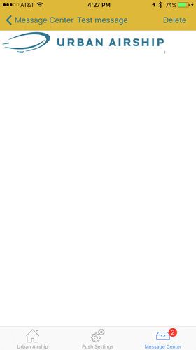
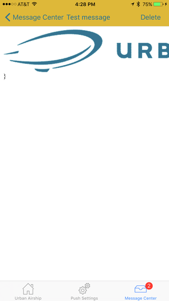

# Urban Airship iOS SDK Migration Guide
# Urban Airship Library 8.x to 8.3.0
## WKWebView Support
Version 8.3.0 adds support for iOS's [WKWebView](https://developer.apple.com/reference/webkit/wkwebview). UIWebView support for Urban Airship's default message center and overlay views will be removed in iOS SDK 9.0.
### [useWKWebView](https://docs.urbanairship.com/reference/libraries/ios/latest/Classes/UAConfig.html#/c:objc(cs)UAConfig(py)useWKWebView) key
By including the "useWKWebView" key in AirshipConfig.plist and setting the value to "YES", you can enable WKWebView support for messages in the default message center ([UADefaultMessageCenter](https://docs.urbanairship.com/reference/libraries/ios/latest/Classes/UADefaultMessageCenter.html)) and for landing pages ([UALandingPageOverlayController](https://docs.urbanairship.com/reference/libraries/ios/latest/Classes/UALandingPageOverlayController.html)).
### [UAWKWebViewNativeBridge](https://docs.urbanairship.com/reference/libraries/ios/latest/Classes/UAWKWebViewNativeBridge.html)
UAWKWebViewNativeBridge is the interface for integrating Urban Airship features into your own WKWebViews. Please see the [iOS Message Center Customization Topic Guide](https://docs.urbanairship.com/topic-guides/ios-message-center-customization.html) or the [Custom Events Guide](https://docs.urbanairship.com/guides/custom-events/) for more information
### Scaling differences
WKWebView by default scales the content to fit the view. This is different than UIWebView. The following is an example of the rendering of simple message center message with a body containing only an image tag: ``

WKWebView | UIWebView
--- | ---
<div style="text-align:center"></div> | <div style="text-align:center"></div>

Fully styled content, such as that contained in messages created in the [Rich Content Editor](https://docs.urbanairship.com/engage/rich-content-editor/) of the Message Composer, will render identically using either type of web view.

# Urban Airship Library 7.3.0 to 8.0.0

This version supports iOS 8, 9 and 10. Xcode 8 is required.

## Application Integration

All application integration points have been moved to [UAAppIntegration](https://docs.urbanairship.com/reference/libraries/ios/latest/Classes.html#/c:objc(cs)UAAppIntegration).
If your application disabled automatic integration, it will need to be updated to call
the new methods:

UIApplicationDelegate methods:

```swift
func application(application: UIApplication, didRegisterForRemoteNotificationsWithDeviceToken deviceToken: NSData)

func application(application: UIApplication, didReceiveRemoteNotification userInfo: [NSObject : AnyObject], fetchCompletionHandler completionHandler: (UIBackgroundFetchResult) -> Void)

func application(application: UIApplication, didRegisterUserNotificationSettings notificationSettings: UIUserNotificationSettings)

func application(application: UIApplication, handleActionWithIdentifier identifier: String?, forRemoteNotification userInfo: [NSObject : AnyObject], completionHandler: () -> Void)

func application(application: UIApplication, handleActionWithIdentifier identifier: String?, forRemoteNotification userInfo: [NSObject : AnyObject], withResponseInfo responseInfo: [NSObject : AnyObject], completionHandler: () -> Void)
``` 

```objective-c
+ (void)application:(UIApplication *)application didRegisterForRemoteNotificationsWithDeviceToken:(NSData *)deviceToken;

+ (void)application:(UIApplication *)application didReceiveRemoteNotification:(NSDictionary *)userInfo fetchCompletionHandler:(void (^)(UIBackgroundFetchResult))completionHandler;

+ (void)application:(UIApplication *)application didRegisterUserNotificationSettings:(UIUserNotificationSettings *)notificationSettings;

+ (void)application:(UIApplication *)application handleActionWithIdentifier:(NSString *)identifier forRemoteNotification:(NSDictionary *)userInfo completionHandler:(void (^)())handler;

+ (void)application:(UIApplication *)application handleActionWithIdentifier:(NSString *)identifier forRemoteNotification:(NSDictionary *)userInfo withResponseInfo:(nullable NSDictionary *)responseInfo completionHandler:(void (^)())handler;
``` 

UNUserNotificationDelegate methods:

```swift
func userNotificationCenter(center: UNUserNotificationCenter, didReceiveNotificationResponse response: UNNotificationResponse, withCompletionHandler completionHandler: () -> Void)

func userNotificationCenter(center: UNUserNotificationCenter, willPresentNotification notification: UNNotification, withCompletionHandler completionHandler: (_ options: UNNotificationPresentationOptions) -> Void)
``` 

```objective-c
+ (void)userNotificationCenter:(UNUserNotificationCenter *)center
didReceiveNotificationResponse:(UNNotificationResponse *)response
         withCompletionHandler:(void(^)())completionHandler;

+ (void)userNotificationCenter:(UNUserNotificationCenter *)center
       willPresentNotification:(UNNotification *)notification
         withCompletionHandler:(void (^)(UNNotificationPresentationOptions options))completionHandler;
``` 

## UAPush

The property `launchNotification` has been replaced with `launchNotificationResponse`
and will contain a `UANotificationResponse`.

Notification categories and types have been removed. Instead you can set UANotificationOptions
and UANotificationCategory and the SDK will automatically convert the properties to the
appropriate types depending on the OS version.

```swift
// Old
func currentEnabledNotificationTypes() -> UIUserNotificationType
var userNotificationTypes: UIUserNotificationType
var userNotificationCategories = Set<NSObject>()

// New
var notificationOptions: UANotificationOptions
var authorizedNotificationOptions: UANotificationOptions
var customCategories: Set<UANotificationCategory>
``` 

```objective-c
// Old
- (UIUserNotificationType)currentEnabledNotificationTypes;
@property (nonatomic, assign) UIUserNotificationType userNotificationTypes;
@property (nonatomic, strong) NSSet *userNotificationCategories;

// New
@property (nonatomic, assign) UANotificationOptions notificationOptions;
@property (nonatomic, assign, readonly) UANotificationOptions authorizedNotificationOptions;
@property (nonatomic, strong) NSSet <UANotificationCategory *>customCategories;
``` 

## UAPushNotificationDelegate

The UAPushNotificationDelegate has been rewritten to be more aligned with iOS 10.
The following methods are provided:

```swift
func receivedForegroundNotification(_ notificationContent: UANotificationContent, completionHandler: () -> Void)
func receivedBackgroundNotification(_ notificationContent: UANotificationContent, completionHandler: (UIBackgroundFetchResult) -> Void)
func receivedNotificationResponse(_ notificationResponse: UANotificationResponse, completionHandler: () -> Void)
func presentationOptions(for notification: UNNotification) -> UNNotificationPresentationOptions
``` 

```objective-c
-(void)receivedForegroundNotification:(UANotificationContent *)notificationContent completionHandler:(void (^)())completionHandler;
-(void)receivedBackgroundNotification:(UANotificationContent *)notificationContent completionHandler:(void (^)(UIBackgroundFetchResult))completionHandler;
-(void)receivedNotificationResponse:(UANotificationResponse *)notificationResponse completionHandler:(void (^)())completionHandler;
- (UNNotificationPresentationOptions)presentationOptionsForNotification:(UNNotification *)notification;
``` 

## UAUtils

The `isBackgroundPush` method has been replaced with `isSilentPush`.

# Urban Airship Library 7.2.x to 7.3.0

## Named User

[UANamedUser](https://docs.urbanairship.com/reference/libraries/ios/latest/Classes.html#/c:objc(cs)UANamedUser) access has been moved to [UAirship](https://docs.urbanairship.com/reference/libraries/ios/latest/Classes.html#/c:objc(cs)UAirship).

Added

```swift
UAirship.namedUser().identifier = "NamedUserID"
``` 

```objective-c
[UAirship namedUser].identifier = @"NamedUserID";
``` 

Deprecated

```swift
UAirship.push().namedUser.identifier = "NamedUserID"
``` 

```objective-c
[UAirship push].namedUser.identifier = @"NamedUserID";
``` 

## Location Service

[UALocationService](https://docs.urbanairship.com/reference/libraries/ios/latest/Classes.html#/c:objc(cs)UALocationService) and [UALocationServiceDelegate](https://docs.urbanairship.com/reference/libraries/ios/latest/Classes.html#/c:objc(cs)UALocationServiceDelegate) has been deprecated and
replaced with [UALocation](https://docs.urbanairship.com/reference/libraries/ios/latest/Classes.html#/c:objc(cs)UALocation) and [UALocationDelegate](https://docs.urbanairship.com/reference/libraries/ios/latest/Classes.html#/c:objc(cs)UALocationDelegate). See [iOS Platform Guide](https://docs.urbanairship.com/platform/ios#ios-location) on
how to use the new location APIs.

# Urban Airship Library 7.0.0 to 7.2.x

## Wallet Action

The Urban Airship library no longer references the Passkit framework for the wallet action.
This is to work around the App Store incorrectly showing an app "Supports Wallet"
when it does not contain wallet capabilities (Radar #24942020). The wallet action
now behaves exactly like the open URL external action. If the old wallet action
behavior is desired, please see [Apple Wallet extension](https://github.com/urbanairship/ua-extensions/tree/master/AppleWallet).

***See legacy migration guide for older migrations***
